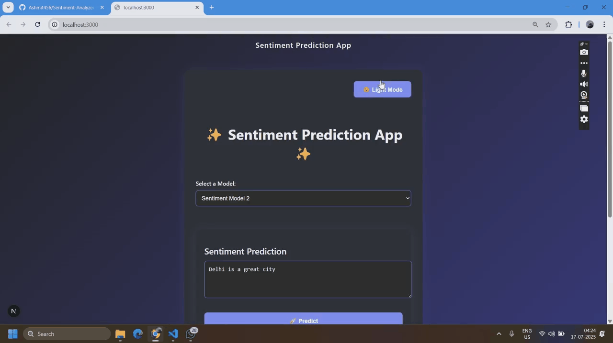

# Sentiment Analysis Web Application

A modern web application that predicts the sentiment of text using multiple machine learning models. Built with Next.js frontend and Flask backend.

## Features

- 🎭 **Multiple ML Models**: Choose between three sentiment analysis models:
  - Logistic Regression
  - Random Forest
  - XGBoost
- 🌓 **Dark/Light Mode**: Seamless theme switching for comfortable viewing
- 📱 **Responsive Design**: Works beautifully on desktop and mobile devices
- ⚡ **Real-time Predictions**: Instant sentiment analysis feedback
- 🎨 **Modern UI**: Clean and intuitive interface

## Demo




## Project Structure

The project is organized into two main directories:

### Backend (`/backend`)

- **app.py**: Flask server handling API requests and model predictions
- **models/**: Pre-trained sentiment analysis models
  - `Logistic_Regression.pkl`
  - `Random_Forest.pkl`
  - `XGBoost.pkl`
  - `tfidf_vectorizer.pkl`
- **sentiment_analysis.ipynb**: Jupyter notebook for model training
- **requirements.txt**: Python dependencies

### Frontend (`/frontend`)

- **src/components/**: React components
  - `ModelSelector.tsx`: Model selection dropdown
  - `PredictionForm.tsx`: Text input and submission
  - `PredictionResult.tsx`: Result display
  - `ThemeToggle.tsx`: Theme switcher
  - `Header.tsx`: App header
  - `Footer.tsx`: App footer
- **src/pages/**: Next.js pages
- **src/styles/**: CSS styles
- **src/utils/**: API utilities

## Tech Stack

### Frontend
- **Framework**: Next.js with TypeScript
- **UI Library**: React
- **Styling**: CSS Modules with CSS Variables
- **HTTP Client**: Axios
- **Development Tools**: ESLint, Prettier

### Backend
- **Server**: Flask with CORS
- **ML Libraries**: 
  - scikit-learn for models
  - pandas & numpy for data processing
  - joblib for model serialization
- **Development Tools**: Jupyter Notebook

## Getting Started

### Prerequisites
- Node.js 14+ and npm
- Python 3.8+
- pip

### Running the Application

1. **Backend Setup**:
```bash
cd backend
pip install -r requirements.txt
python app.py
```
The backend will start on http://localhost:5000

2. **Frontend Setup**:
```bash
cd frontend
npm install
npm run dev
```
The frontend will start on http://localhost:3000

## Usage

1. Visit http://localhost:3000 in your browser
2. Select one of the three sentiment analysis models:
   - Logistic Regression: Fast and efficient
   - Random Forest: Balanced performance
   - XGBoost: High accuracy
3. Enter your text in the input field
4. Click "Predict" to see the sentiment (Positive/Negative)
5. Use the theme toggle in the top-right to switch between light and dark modes

## Model Performance

All models were trained on a large Twitter sentiment dataset:
- Logistic Regression: 77.12% accuracy
- Random Forest: 76.57% accuracy
- XGBoost: 74.57% accuracy

## Contributing

Contributions are welcome! Please feel free to submit pull requests.

## License

This project is licensed under the MIT License.

## Author

Ashmit Gupta

## Acknowledgments

- Twitter Sentiment Analysis Dataset
- Next.js and Flask communities
- scikit-learn documentation
